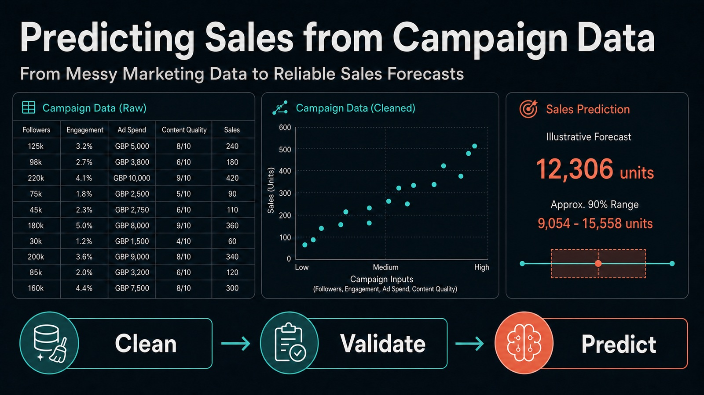
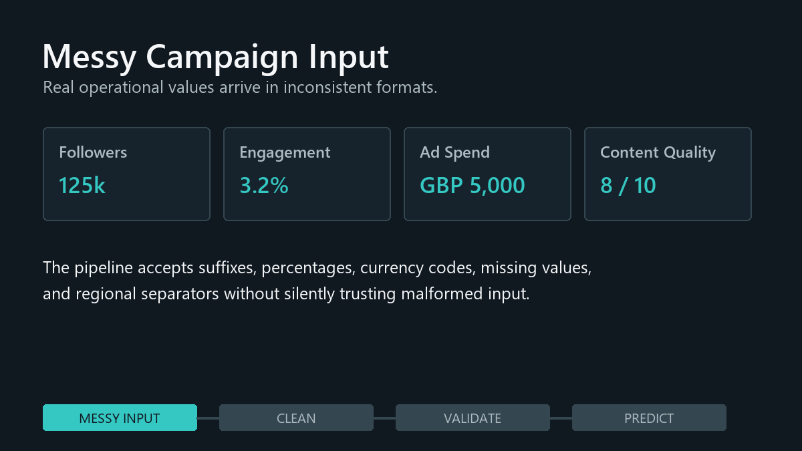

<p align="center">
  
</p>

# Predicting Sales from Campaign Data

An end-to-end machine learning case study that turns messy influencer-campaign
data into planning-time sales forecasts with input validation, temporal
evaluation, and prediction uncertainty.

[](https://www.python.org/)
[](https://scikit-learn.org/)
[](https://pandas.pydata.org/)
[](predicting_sales_campaign_data_case_study.ipynb)
[](LICENSE)
[](https://github.com/banshiAbp/Predicting-Sales-from-Campaign-Data/commits/main)
[](https://github.com/banshiAbp/Predicting-Sales-from-Campaign-Data/stargazers)
[](predicting_sales_campaign_data_case_study.pdf)

> **Verified outcome:** The deployment-aligned Lasso model achieved an RMSE of
> **1,956 units**, MAE of **1,564 units**, and R² of **0.504** on the latest-20%
> temporal holdout. **71.81%** of predictions were within ±20% of actual sales.

## Prediction Demo

<p align="center">
  
</p>
<p align="center">
  <em>Illustrative input using the final four-feature planning-time pipeline.</em>
</p>

## Why This Project?

Marketing teams need to estimate campaign outcomes before committing creator
budgets. Real operational data rarely arrives model-ready: follower counts may
use `k` suffixes, engagement may be stored as percentages, spend may include
currency text, and invalid values can be mixed with missing records.

This project builds a reproducible regression workflow that cleans those inputs,
prevents post-campaign leakage, compares random and chronological validation, and
returns both a sales estimate and an uncertainty range.

## Project Highlights

- Robust parser for currency codes, symbols, percentages, suffixes, and regional separators
- Missing-value, invalid-range, outlier, duplicate-ID, and train-test shift audits
- Evidence-based follower-unit assumption with random and temporal sensitivity tests
- Explicit exclusion of campaign-end `Timestamp`, post-campaign `Notes`, and identifier `ID`
- Comparison of eight regression approaches under random and temporal validation
- Tuned Lasso, Ridge, Elastic Net, and histogram gradient boosting models
- Stakeholder metrics, residual segmentation, target-outlier analysis, and prediction bias
- Independently evaluated residual-based prediction range
- Reusable CLI with invalid-input warnings and reliability flags

## Project Workflow


## Prediction Timing

The model is designed for **pre-launch campaign planning**.

| Field | Treatment |
|---|---|
| Followers | Included as the planning-time follower count |
| Planned ad spend | Included under the planned-budget assumption |
| Historical engagement rate | Included only if known before launch |
| Pre-launch content quality | Included only if scored before approval |
| Campaign-end timestamp | Excluded from prediction; used for temporal validation |
| Notes | Excluded because they may be recorded during or after completion |
| ID | Used only to join predictions back to campaigns |
| Sales | Post-campaign prediction target |

The data owner should confirm that engagement, spend, and content quality are
available at the decision point before production deployment.

## Dataset

| Split | Rows | Purpose |
|---|---:|---|
| Training | 8,000 | Cleaning, model development, tuning, and holdout evaluation |
| Test | 2,000 | Final sales prediction |

Core model inputs:

- `Followers`
- `EngagementRate (%)`
- `AdSpend (GBP)`
- `ContentQuality`

Target: `Sales (Units)`

The supplied data intentionally contains missing values, mixed formats, extreme
outliers, negative spend, and inconsistent follower units. The original
[case-study dataset](https://drive.google.com/drive/folders/1BCTayfVYwapGcGl3Mizik1E6-zPcQ_DT?usp=sharing)
is used for educational analysis.

## Final Results

| Validation | RMSE | MAE | R² | Within ±20% | RMSE reduction vs baseline |
|---|---:|---:|---:|---:|---:|
| Random holdout | 2,042 | 1,633 | 0.475 | 69.06% | 27.58% |
| Latest-20% temporal holdout | **1,956** | **1,564** | **0.504** | **71.81%** | **29.59%** |

The temporal holdout is the deployment-oriented result because every evaluated
campaign occurs after the development period.

### Prediction Uncertainty

| Measure | Result |
|---|---:|
| Calibration records | 1,288 |
| Approximate interval radius | 3,252 units |
| Temporal-holdout coverage | 90.9% |
| Target coverage | 90% |

The global range is calibrated using a held-out chronological subset of
development data and checked on the untouched temporal holdout. It communicates
uncertainty but is not a formal guarantee for every campaign segment.

## Model Comparison

| Temporally tuned model | Best CV RMSE |
|---|---:|
| **Lasso, α = 30** | **2,034.47** |
| Ridge, α = 100 | 2,035.00 |
| Elastic Net | 2,035.47 |
| Histogram gradient boosting | 2,077.70 |

Lasso won by a narrow margin. Ridge and Elastic Net are effectively tied within
cross-validation variability. Under the tested configurations, the regularized
linear models performed better than the evaluated tree ensembles; this does not
prove that the underlying business relationship is inherently additive.

## Predictive Associations

| Input | Permutation importance |
|---|---:|
| Followers | 0.575 |
| Ad spend | 0.317 |
| Content quality | 0.054 |
| Engagement rate | 0.010 |

Followers and ad spend are the strongest predictive inputs in this historical
dataset. These are associations, not causal estimates: the analysis does not
prove that changing either factor will cause an equivalent change in sales.

## Data-Quality Findings

- Plain small-follower values affect 2.5% of training rows and 10% of test rows.
- Automatic ×1,000 interpretation improved random RMSE by 144 units and temporal RMSE by 155 units.
- The scaling treatment remains a documented dataset assumption requiring owner confirmation.
- Missing or invalid core inputs produce materially higher out-of-fold error.
- The 50 IQR-flagged target extremes were retained and reported rather than automatically removed.
- Cleaned train and test business-variable distributions are similar, but test data contains more formatting issues.

## Quick Start

### 1. Clone and install

```bash
git clone https://github.com/banshiAbp/Predicting-Sales-from-Campaign-Data.git
cd Predicting-Sales-from-Campaign-Data

python -m venv .venv
```

Activate the environment:

```bash
# Windows PowerShell
.\.venv\Scripts\Activate.ps1

# macOS/Linux
source .venv/bin/activate
```

Install dependencies:

```bash
pip install -r requirements.txt
```

### 2. Run the complete case study

```bash
jupyter notebook predicting_sales_campaign_data_case_study.ipynb
```

Run all cells from top to bottom. The notebook contains the complete analysis,
model selection, final training, prediction function, outputs, and conclusions.

### 3. Run the reusable prediction pipeline

Illustrative campaign:

```bash
python case_study_pipeline.py
```

Score the supplied messy test data:

```bash
python case_study_pipeline.py \
  --input-data messy_test_data.csv \
  --output campaign_predictions.csv
```

Run the focused parser and follower-scaling checks:

```bash
python -m unittest discover -s tests -v
```

## Illustrative Prediction

Input:

| Followers | Engagement | Ad spend | Content quality |
|---:|---:|---:|---:|
| 125k | 3.2% | GBP 5,000 | 8 |

Output:

| Expected sales | Approximate 90% range | Reliability |
|---:|---:|---|
| **12,306 units** | **9,054–15,558 units** | Standard |

Malformed or invalid inputs are explicitly reported, listed as imputed fields,
and marked `Review - imputed input`.

## Repository Structure

```text
.
|-- docs/assets/                                # README visuals
|-- tests/test_pipeline.py                      # Parser and scaling checks
|-- case_study_pipeline.py                      # Reusable training/prediction CLI
|-- predicting_sales_campaign_data_case_study.ipynb
|-- predicting_sales_campaign_data_case_study.pdf
|-- messy_train_data.csv
|-- messy_test_data.csv
|-- messy_test_predictions.csv
|-- case_study_metrics.json                     # Verified result snapshot
|-- requirements.txt
|-- LICENSE
`-- README.md
```

## Business Use

The model can support campaign planning, scenario comparison, and budget review.
Sales volume alone is not sufficient for profitable allocation. A production
decision layer should also calculate:

- Predicted cost per sale
- Predicted revenue and ROAS
- Predicted profit using product-level unit margin
- Inventory and fulfillment constraints
- Creator-audience fit and brand risk

## What I Learned

- Cleaning assumptions should be tested, documented, and confirmed with data owners.
- Random validation and temporal validation answer different business questions.
- Features available after campaign completion can create misleadingly strong models.
- Simpler features can be preferable when engineering adds no meaningful validation gain.
- Prediction uncertainty and segment-level error matter as much as aggregate R².
- Predictive importance describes association and should not be presented as causation.

## Limitations and Responsible Use

- The dataset omits product type, discounting, audience demographics, creator fit, competitor activity, and inventory.
- The follower-unit rule is supported by validation evidence but remains an assumption.
- Prediction ranges are global and may not achieve equal coverage in every segment.
- Extreme-sales campaigns have substantially larger errors.
- Commercial deployment requires monitoring for drift and confirmation of feature availability.

## Future Improvements

- Add product price and margin for profit-aware campaign ranking
- Monitor input and prediction drift after deployment
- Evaluate group-conditional or conformal prediction intervals
- Add model and data-version tracking with MLflow
- Package the predictor as a FastAPI service and Docker image
- Build a lightweight dashboard for campaign scenarios and portfolio allocation

## License and Data Note

The original code in this repository is available under the [MIT License](LICENSE).
The dataset and any third-party materials remain subject to their original terms.
Confirm the dataset license before reuse or redistribution outside this educational
case study.

**Data ethics note:** The dataset contains campaign-level business fields and
numeric identifiers, not creator names or contact details. The README example is
illustrative and does not identify a real campaign or influencer.

## Suggested GitHub Topics

`machine-learning` `data-science` `regression` `marketing-analytics`
`scikit-learn` `python` `jupyter-notebook` `feature-engineering`
